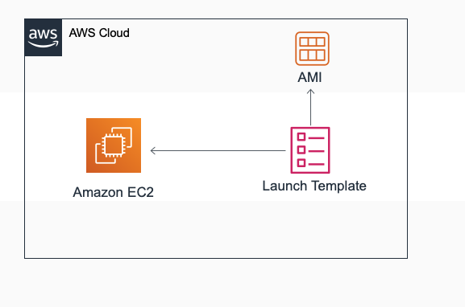

# Hands-on EC2-03 : Creating an Instance with Launch Template and Versioning

Purpose of the this hands-on training is to give the students understanding of how to create Launch Template on AWS Console with `user data` and how to version Launch Templates.

## Learning Outcomes

At the end of the this hands-on training, students will be able to;

- create and configure Launch Templates.

- modify Launch Template with versioning.

## Outline

- Part 1 - Creating Launch Templates

- Part 2 - Modifying Launch Templates



## Part 1 - Creating Launch Templates

### Step 1: Create Security Group

- Create a Security Group to be used in Launch Template.

```text
1. Launch_Temp_Sec_group: SSH 22, HTTP 80 ----> anywhere(0.0.0.0/0)
```

### STEP 2: Create Launch Template

- Open the Amazon EC2 console at https://console.aws.amazon.com/ec2/.

- On the navigation pane, under `INSTANCES`, choose `Launch Templates`.

- Click on `Create launch template`.

- Enter a name and provide a description for the initial version of the launch template.

```text
Name                         : MyClaruswayTemplate
Template version description : Origin
```

- Autoscaling Guidance

```text
Keep it as default
```

- Template Tags

```text
Keep it as is
```

- Source Template :

```text
Keep it as is
```

- Amazon machine image (AMI)

```text
Amazon Linux 2 AMI (HVM), SSD Volume Type
```

- Instance Type

```text
t2.micro
```

- Key pair

```text
Please select your key pair (pem key) that is created before
Example: clarusway.pem
```

- Network settings

```text
Network Platform : Virtual Private Cloud (VPC)
```

- Security groups

```text
Security Group Name: Launch_Temp_Sec_group
```

- Storage (volumes)

```text
we keep it as is  (Volume 1 (AMI Root) (8 GiB, EBS, General purpose SSD (gp2)))
```

- Resource tags

```text
Key             : Name
Value           : Webserver-Origin
Resource type   : Instance
```

- Network interfaces

```text
Keep it as is
```

- Advance details

```text
Keep it as is
```

### Step 3: Create an Instance with Launch Template

- Go to `Launch Template` Menu

- Select `MyClaruswayTemplate` ---> `Actions` ---> `Launch Instance from Template`

- Enter number of instance as `1`.

- Keep the rest of settings as is and click the `Launch instance from template` at the bottom.

- Go to EC2 Instance menu and show the created instance.

## Part 2 - Modifying Launch Template

### Step 1: Launch Template Version 1

- Go to Launch Template menu on the left hand pane

- Select template named `MyClaruswayTemplate` ---> `Actions` ---> `Modify template (Create New Version)`

- Template version description

```text
V1 nginx
```

- Key pair

```text
Select your .pem file name
```

- Resource tags

```text
Key             : Name
Value           : Webserver-V1
Resource type   : Instance
```

- Go to `Advance Details` on the bottom and add the script given below into the `user data` field.

```bash
#!/bin/bash
yum update -y
amazon-linux-extras install nginx1.12
systemctl enable nginx
systemctl start nginx
```

- Go to `Launch Template` Menu and click on `MyClaruswayTemplate`.

- Select version `2` from the `Versions` tab.

```text
Version         : 2
Description     : V1 nginx
```

- Select `Actions` ---> `Launch instance from template`.

```text
Number of Instance : 1
```

- Click the `launch Instance from template` button at the bottom.

- Go to `Instance Menu` and show recently created EC2 instance.

- Copy EC2's `Public IP`, paste it in a browser and show `nginx` webpage.

### Step 2: Launch Template Version 2

- Go to `Launch Template` menu on the left hand pane.

- Select template named `MyClaruswayTemplate` ---> `Actions` ---> `Modify template (Create New Version)`.

- Template version description

```text
V2 nginx
```

- Key pair

```text
Select your .pem file name
```

- Resource tags

```text
Key             : Name
Value           : Webserver-V2
Resource type   : Instance
```

- Go to `Advance Details` on the bottom and add the script given below into the `user data` field.

```bash
#!/bin/bash
yum update -y
amazon-linux-extras install nginx1.12
chkconfig nginx on
cd /usr/share/nginx/html
chmod o+w /usr/share/nginx/html
rm index.html
wget https://raw.githubusercontent.com/awsdevopsteam/route-53/master/index.html
wget https://raw.githubusercontent.com/awsdevopsteam/route-53/master/ken.jpg
service nginx start
```

- Go to `Launch Template` Menu and click on `MyClaruswayTemplate`.

- Select version `3` from the `Versions` tab.

```text
Version         : 3
Description     : V2 nginx
```

- Select `Actions` ---> `Launch instance from template`.

```text
Number of Instance : 1
```

- Click the `launch Instance from template` button at the bottom.

- Go to `Instance Menu` and show recently created EC2 instance.

- Copy EC2's `Public IP`, paste it in a browser and show `nginx` webpage with `Ken` image.
