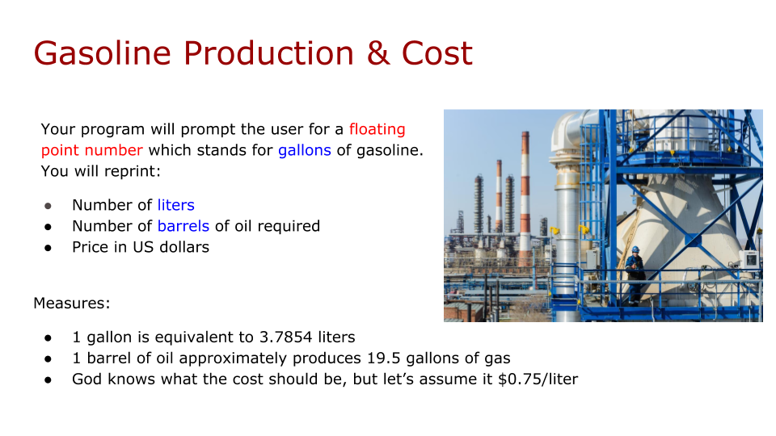

<h1><strong>TEAM LEAD VERSION (Week-2)</strong>

 
 
 
 
 
 

<h1><strong>Meeting Agenda</strong></h1>

▶ Icebreaking 

▶ Questions 

▶ Interview/Certification Questions

▶ Coding Challenge

▶ Video of the
week

▶ Retro
meeting

▶ Case study /
project

 
 
 

<h1><strong>Teamwork Schedule</strong></h1>

<table style= "width:100%;">
                <tr>
                <td style="color: #FA8072; text-align:left "><h3><strong>
Ice-breaking</td>
                <td style="color: #FA8072; text-align:right;"><h3><strong>
10m
<td>                </tr>
</table>

- Personal Questions (Stay at home & Corona, Study Environment, Kids etc.) 
- Any challenges (Classes, Coding, AWS, studying, etc.) 
- Ask how they’re studying, give personal advice. 
- Remind that practice makes perfect. 

 
<table style= "width:100%;">
                <tr>
                <td style="color: #FA8072; text-align:left "><h3><strong>
Ask Questions</td>
                <td style="color: #FA8072; text-align:right;"><h3><strong>
20m
<td>                </tr>
</table>

**1. What is BASH?**
 
**Answer:** *BASH is short for Bourne Again Shell (represented by /bin/bash). It was written by Steve Bourne as a replacement to the original Bourne Shell (represented by /bin/sh). It combines all the features from the original version of Bourne Shell, plus additional functions to make it easier and more convenient to use. It has since been adapted as the default shell for most systems running Linux.*

 

**2. What is Linux Kernel?**

**Answer:** *The Linux Kernel is a low-level systems software whose main role is to manage hardware resources for the user. It is also used to provide an interface for user-level interaction.*

 

**3. What is the function of git clone?**

**Answer:** *The git clone command creates a copy of an existing Git remote repository to local.*

 

**4. What does commit object contains?**

**Answer:** *Commit object contains the following components, you should mention all the three points present below: 
• A set of files, representing the state of a project at a given point of time 
• Reference to parent commit objects 
• An SHA-1 name, a 40 character string that uniquely identifies the commit object.*

  
 
   

**5. What are local variables and global variables in Python?**

**Answer:**   **Global Variables:**
*Variables declared outside a function or in global space are called global variables. These variables can be accessed by any function in the program.*  
**Local Variables:** *Any variable declared inside a function is known as a local variable (unless explicitly declared as global with “Global” keyword). This variable is present in the local space and not in the global space.* 

 

<table style= "width:100%;">
                <tr>
                <td style="color: #FA8072; text-align:left "><h3><strong>
Interview/Certification Questions</td>
                <td style="color: #FA8072; text-align:right;"><h3><strong>
20m
<td>                </tr>
</table>

**1. Which AWS services can be used to store files?  Choose 2 answers from the options given below:**

<strong>A.</strong> Amazon CloudWatch   
<strong>B.</strong> Amazon Simple Storage Service (Amazon S3)    
<strong>C.</strong> Amazon Elastic Block Store (Amazon EBS) 
   
<strong>D.</strong> AWS Config    
<strong>E.</strong>  Amazon Athena     

**Answer:** *B and C* 

*Amazon S3 is object storage built to store and retrieve any amount of data from anywhere – web sites and mobile apps, corporate applications, and data from IoT sensors or devices. It is designed to deliver 99.999999999% durability, and stores data for millions of applications used by market leaders in every industry. 
For more information on the Simple Storage Service, please refer to the*  [Link](https://aws.amazon.com/s3/)

*Amazon Elastic Block Store (Amazon EBS) provides persistent block storage volumes for use with Amazon EC2 instances in the AWS Cloud. Each Amazon EBS volume is automatically replicated within its Availability Zone to protect you from component failure, offering high availability and durability.
For more information on Amazon EBS, please refer to the* [Link](https://aws.amazon.com/ebs)

*Answer A is incorrect. Amazon CloudWatch is used for performance monitoring.* 
*Answer D is incorrect. AWS Config is used to audit and monitor configuration changes.* 
*Answer E is incorrect. Amazon Athena is a serverless query service used to analyze BigData stored in S3.*

 

**2. The company you work for is considering migrating to AWS. They are concerned about cost and the initial investment needed. Which of the following features of AWS pricing helps lower the initial investment amount needed? Choose 3 answers from the options given below:**

<strong>A.</strong> The ability to choose the lowest cost vendor  
<strong>B.</strong> The ability to pay as you go   
<strong>C.</strong> No upfront costs   
<strong>D.</strong> Discounts for upfront payments 

    

**Answer:** *B, C, and D*  
*A is incorrect. The ability to choose the lowest cost vendor is not exclusive to AWS over on-premise solutions.
The some of the good reasons of moving to the AWS Cloud are:* 
1. No upfront costs  
2. The ability to pay as you go where the customer only pays for the resources needed  

*For more Cloud pricing info go to:*  [Link](https://aws.amazon.com/pricing)  
*On-demand EC2 instances offer no upfront costs whereas for the reserved instances they offer a discount for the upfront costs you pay.*

 

**3. What problems do IAM roles solve?**

**Answer:** *IAM roles allow you to delegate access with defined permissions to trusted entities without having to share long-term access keys. You can use IAM roles to delegate access to IAM users managed within your account, to IAM users under a different AWS account, or to an AWS service such as EC2.* 
*AWS IAM Documentation*  [Link](https://docs.aws.amazon.com/IAM/latest/UserGuide/introduction.html) 

 

**4. Who is able to manage users for an AWS account?**

**Answer:** *The AWS account holder can manage users, groups, security credentials, and permissions. In addition, you may grant permissions to individual users to place calls to IAM APIs in order to manage other users. For example, an administrator user may be created to manage users for a corporation—a recommended practice. When you grant a user permission to manage other users, they can do this via the IAM APIs, AWS CLI, or IAM console.*

 

**5. Can you define users regionally?**

**Answer:** *Users are global entities, like an AWS account is today. No region is required to be specified when you define user permissions. Users can use AWS services in any geographic region.*

              

<table style= "width:100%;">
                <tr>
                <td style="color: #FA8072; text-align:left "><h3><strong>
Coding  Challenge</td>
                <td style="color: #FA8072; text-align:right;"><h3><strong>
10m
<td>                </tr>
</table>

- [Codding Challenge - 001: Gasoline Production & Cost](https://github.com/clarusway/clarusway-aws-devops-pro-3-20/tree/master/python/coding-challenges/cc-001-calculate-gasoline-production-cost) 

 

  

<table style= "width:100%;">
                <tr>
                <td style="color: #FA8072; text-align:left "><h3><strong>
Video of the Week</td>
                <td style="color: #FA8072; text-align:right;"><h3><strong>
5m
<td>                </tr>
</table>

- [Python Strings](https://www.youtube.com/watch?v=iAzShkKzpJo&list=PLi01XoE8jYohWFPpC17Z-wWhPOSuh8Er-&index=3)

 

<table style= "width:97%;">
                <tr>
                <td style="color: #FA8072; text-align:left "><h3><strong>
Retro Meeting on a personal and team level</td>
                <td style="color: #FA8072; text-align:right;"><h3><strong>
10m
<td>                </tr>
</table>

Ask the questions below:

- What went well? 
- What could be improved? 
- What will we commit to do better in the next week? 

     

<table style= "width:100%;">
                <tr>
                <td style="color: #FA8072; text-align:left "><h3><strong>
Case study/Project</td>
                <td style="color: #FA8072; text-align:right;"><h3><strong>
15m
<td>                </tr>
</table>

**Case study should be explained to the students during the weekly meeting and has to be completed in one sprint (2 weeks) by the students. Students should work in small teams to complete the case study.**

- [Project-101 : Kittens Carousel Static Website deployed on AWS EC2 using Cloudformation](https://github.com/clarusway/clarusway-aws-devops-pro-3-20/tree/master/aws/projects/101-kittens-carousel-static-website-ec2)
 

<table style= "width:105%;">
                <tr>
                <td style="color: #FA8072; text-align:left "><h3><strong>
Closing</td>
                <td style="color: #FA8072; text-align:right;"><h3><strong>
5m
<td>                   </tr>
</table>

-Next week’s plan

-QA Session 

