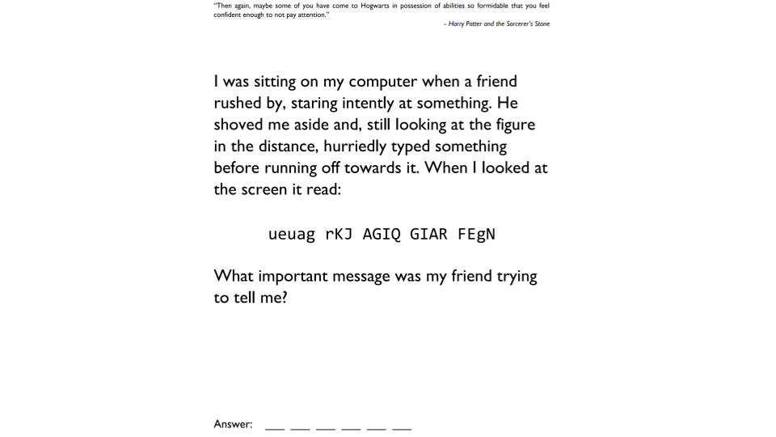

<h1><strong>STUDENT VERSION (Week-24)</strong>

 
 
 
 
 
 

<h1><strong>Meeting Agenda</strong></h1>

▶ Icebreaking 

▶ Questions 

▶ Interview/Certification Questions

▶ Coding Challenge

▶ Video of the
week

▶ Retro
meeting

▶ Case study /
project

 
 
 

<h1><strong>Teamwork Schedule</strong></h1>

<table style= "width:100%;">
                <tr>
                <td style="color: #FA8072; text-align:left "><h3><strong>
Ice-breaking</td>
                <td style="color: #FA8072; text-align:right;"><h3><strong>
10m
<td>                </tr>
</table>

- Personal Questions (Stay at home & Corona, Study Environment, Kids etc.) 
- Any challenges (Classes, Coding, AWS, studying, etc.) 
- Ask how they’re studying, give personal advice. 
- Remind that practice makes perfect. 

 

<table style= "width:100%;">
                <tr>
                <td style="color: #FA8072; text-align:left "><h3><strong>
Team work</td>
                <td style="color: #FA8072; text-align:right;"><h3><strong>
10m
<td>                </tr>
</table>

- Ask what exactly each student does for the team, if they know each other, if they care for each other, if they follow and talk with each other etc. 

<table style= "width:100%;">
                <tr>
                <td style="color: #FA8072; text-align:left "><h3><strong>
Ask Questions</td>
                <td style="color: #FA8072; text-align:right;"><h3><strong>
20m
<td>                </tr>
</table>

**1. What is the trigger function in AWS Lambda?**
 
 

**2. What is Amazon API Gateway?**

 

**3. What are the Reading Methods of the CSV Files in Python?**

 

**4. Give some examples of standard errors that occour in Python.**

 

**5. How to Load a Module in Python?**

          

<table style= "width:100%;">
                <tr>
                <td style="color: #FA8072; text-align:left "><h3><strong>
Interview/Certification Questions</td>
                <td style="color: #FA8072; text-align:right;"><h3><strong>
20m
<td>                </tr>
</table>

**1. Which of the following is a serverless compute offering from AWS?**

<strong>A.</strong> AWS EC2   
<strong>B.</strong> AWS Lambda    
<strong>C.</strong> AWS SNS   
<strong>D.</strong> AWS Config    
<strong>E.</strong>  AWS SQS   

 

**2. Your company is currently hosting a heavy load application on its On-premise environment. The company has developed this application in-house. Consulting companies then use this application via API calls. You now need to consider moving this application to AWS. Which of the following services would best be suited in the architecture design, which would also help deliver a cost-effective solution? Choose 2 answers from the options given below.**

<strong>A.</strong> AWS Lambda  
<strong>B.</strong> AWS API Gateway   
<strong>C.</strong> AWS Config   
<strong>D.</strong> AWS EC2

 

**3. You have an application developed in .NET. This applications works with the S3 buckets in a particular region. The application is hosted on an EC2 Instance. Which of the following should ideally be used to ensure that the EC2 Instance has the appropriate access to the S3 buckets?**

<strong>A.</strong> AWS Users  
<strong>B.</strong> AWS Groups   
<strong>C.</strong> AWS IAM Roles   
<strong>D.</strong> AWS IAM Policies

 

**4. A professional educational institution maintains a dedicated web server and database cluster that hosts an exam results portal for modules undertaken by its students. The resource is idle for most of the learning cycle and becomes excessively busy when exam results are released. How can this architecture be improved to be cost-efficient?**

<strong>A.</strong> Configure AWS elastic load-balancing between the webserver and database cluster 
<strong>B.</strong> Configure RDS multi-availability zone for performance optimisation   
<strong>C.</strong> Configure serverless architecture leveraging AWS Lambda functions   
<strong>D.</strong> Migrate the web servers onto Amazon EC2 Spot Instances
 

     

**5. An application currently allows users to upload files to an S3 bucket. You want to ensure that the file name for each uploaded file is stored in a DynamoDB table. How could this be achieved? (SELECT TWO)**

<strong>A.</strong> Create an AWS Lambda function to insert the required entry for each uploaded file. 
<strong>B.</strong> Use AWS CloudWatch to probe for any S3 event.
  
<strong>C.</strong> Add an event in S3 with notification send to Lambda.
   
<strong>D.</strong> Add the CloudWatch event to the DynamoDB table streams section.

 

<table style= "width:100%;">
                <tr>
                <td style="color: #FA8072; text-align:left "><h3><strong>
Video of the Week</td>
                <td style="color: #FA8072; text-align:right;"><h3><strong>
10m
<td>                </tr>
</table>

- [Exceptions in Python](https://www.youtube.com/watch?v=nlCKrKGHSSk&list=PLi01XoE8jYohWFPpC17Z-wWhPOSuh8Er-&index=32)

 

<table style= "width:97%;">
                <tr>
                <td style="color: #FA8072; text-align:left "><h3><strong>
Retro Meeting on a personal and team level</td>
                <td style="color: #FA8072; text-align:right;"><h3><strong>
10m
<td>                </tr>
</table>

Ask the questions below:

- What went well? 
- What could be improved? 
- What will we commit to do better in the next week? 

 

<table style= "width:100%;">
                <tr>
                <td style="color: #FA8072; text-align:left "><h3><strong>
Problem of the week</td>
                <td style="color: #FA8072; text-align:right;"><h3><strong>
5m
<td>                </tr>
</table>

- Students should work in small teams to complete the problem of the week.

 

<table style= "width:96%;">
                <tr>
                <td style="color: #FA8072; text-align:left "><h3><strong>
Presentation of Coding  Challenge & POW</td>
                <td style="color: #FA8072; text-align:right;"><h3><strong>
20m
<td>                </tr>
</table>

We assume that each group has two sub teams. If this is possible one of the sub teams will present the coding challenge of last week. The other sub team will present the solution to the previous problem of the week. If there is only one sub team then, the sub team will present both of the solutions.

<table style= "width:100%;">
                <tr>
                <td style="color: #FA8072; text-align:left "><h3><strong>
Coding  Challenge</td>
                <td style="color: #FA8072; text-align:right;"><h3><strong>
5m
<td>                </tr>
</table>

- [Codding Challenge: Calculating the Amount of Water to be Trapped on Terrain](https://github.com/clarusway/clarusway-aws-devops-1-20/tree/master/python/coding-challenges/cc-006-calculate-amount-of-water-trapped) 

 

<table style= "width:96%;">
                <tr>
                <td style="color: #FA8072; text-align:left "><h3><strong>
Presentation of Case Study of Previous Sprint</td>
                <td style="color: #FA8072; text-align:right;"><h3><strong>
20m
<td>                </tr>
</table>

We assume that each group has two sub teams. Each week, one of the sub-teams will present their solution.

<table style= "width:100%;">
                <tr>
                <td style="color: #FA8072; text-align:left "><h3><strong>
Case study/Project</td>
                <td style="color: #FA8072; text-align:right;"><h3><strong>
10m
<td>                </tr>
</table>

**Case study should be explained to the students during the weekly meeting and has to be completed in one sprint (2 weeks) by the students. Students should work in small teams to complete the case study.**

- [Project-004 : Phonebook Application (Python Flask) deployed on AWS Application Load Balancer with Auto Scaling and Relational Database Service using AWS Cloudformation](https://github.com/clarusway/clarusway-aws-devops-1-20/tree/master/aws/projects/004-phonebook-web-application)
 

<table style= "width:105%;">
                <tr>
                <td style="color: #FA8072; text-align:left "><h3><strong>
Closing</td>
                <td style="color: #FA8072; text-align:right;"><h3><strong>
5m
<td>                   </tr>
</table>

-Next week’s plan

-QA Session 

