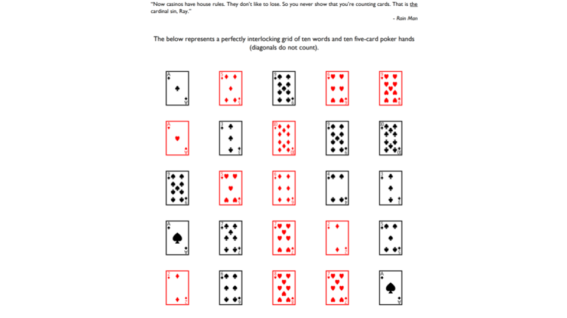

<h1><strong>TEAM LEAD VERSION (Week-25)</strong>

 
 
 
 
 
 

<h1><strong>Meeting Agenda</strong></h1>

▶ Icebreaking 

▶ Questions 

▶ Interview/Certification Questions

▶ Coding Challenge

▶ Video of the
week

▶ Retro
meeting

▶ Case study /
project

 
 
 

<h1><strong>Teamwork Schedule</strong></h1>

<table style= "width:100%;">
                <tr>
                <td style="color: #FA8072; text-align:left "><h3><strong>
Ice-breaking</td>
                <td style="color: #FA8072; text-align:right;"><h3><strong>
10m
<td>                </tr>
</table>

- Personal Questions (Stay at home & Corona, Study Environment, Kids etc.) 
- Any challenges (Classes, Coding, AWS, studying, etc.) 
- Ask how they’re studying, give personal advice. 
- Remind that practice makes perfect. 

<table style= "width:100%;">
                <tr>
                <td style="color: #FA8072; text-align:left "><h3><strong>
Team work</td>
                <td style="color: #FA8072; text-align:right;"><h3><strong>
10m
<td>                </tr>
</table>

- Ask what exactly each student does for the team, if they know each other, if they care for each other, if they follow and talk with each other etc. 

<table style= "width:100%;">
                <tr>
                <td style="color: #FA8072; text-align:left "><h3><strong>
Ask Questions</td>
                <td style="color: #FA8072; text-align:right;"><h3><strong>
20m
<td>                </tr>
</table>

**1. What command should you run to see all running container in Docker?**

<strong>A.</strong> docker run   
<strong>B.</strong> docker ps    
<strong>C.</strong> docker --help   
<strong>D.</strong> docker build    
<strong>E.</strong> docker pull  

**Answer:** B

 

**2. Which of the following is not a state of Docker container?**

<strong>A.</strong> Running   
<strong>B.</strong> Freezed    
<strong>C.</strong> Paused   
<strong>D.</strong> Restarting   
<strong>E.</strong> Exited  

**Answer:** B

  
 
 
 

**3. Imagine that you just joined a development team that uses Git for version control and collaboration. To start contributing to the project, what Git operation would you most likely invoke first?**

<strong>A.</strong> checkout   
<strong>B.</strong> clone    
<strong>C.</strong> export   
<strong>D.</strong> revert   
<strong>E.</strong> update  

**Answer:** B

 

**4. Which of the following services are not supported by AWS Lambda?**

<strong>A.</strong> EC2   
<strong>B.</strong> S3    
<strong>C.</strong> Alexa   
<strong>D.</strong> Cloudront   
<strong>E.</strong> RedShift  

**Answer:** A

*To a certain extent, lambda and EC2 are competing technologies. While lambda aims to remove or drastically reduce the amount of configuration needed to run your software, EC2 exposes the developer to the virtual machine that ultimately runs their code. In addition lambda scales effortlessly while EC2 requires more complex configuration to achieve the same result.*

 

**5. Of the following, which are handled by Lambda by default? (choose 2)?**

<strong>A.</strong> Automatic scaling   
<strong>B.</strong> Security patches    
<strong>C.</strong> Triggers that activate the function   
<strong>D.</strong> The lambda functions code   

**Answer:** A and B

*Lambda provides auto scaling and security patches for the underlying operating systems that run your lambda functions.*
           

<table style= "width:100%;">
                <tr>
                <td style="color: #FA8072; text-align:left "><h3><strong>
Interview/Certification Questions</td>
                <td style="color: #FA8072; text-align:right;"><h3><strong>
20m
<td>                </tr>
</table>

**1. What is difference between virtualization and containerization?**

**Answer:**  

*Containers provide an isolated environment for running the application. The entire user space is explicitly dedicated to the application. Any changes made inside the container is never reflected on the host or even other containers running on the same host. Containers are an abstraction of the application layer. Each container is a different application.*

*Whereas in Virtualization, hypervisors provide an entire virtual machine to the guest(including Kernal). Virtual machines are an abstraction of the hardware layer. Each VM is a physical machine.*

 

**2. What are Docker Images?**

**Answer:**   
*Docker image is the source of Docker container. In other words, Docker images are used to create containers. When a user runs a Docker image, an instance of a container is created. These docker images can be deployed to any Docker environment.*

 

**3. Explain Docker Architecture?**

**Answer:** 

*Docker Architecture consists of a Docker Engine which is a client-server application with three major components:*

- A server which is a type of long-running program called a daemon process (the docker command).
- A REST API which specifies interfaces that programs can use to talk to the daemon and instruct it what to do.
- A command line interface (CLI) client (the docker command).  

*The CLI uses the Docker REST API to control or interact with the Docker daemon through scripting or direct CLI commands. Many other Docker applications use the underlying API and CLI.*
   

**4. You are requested to expose your serverless application implemented with AWS Lambda to HTTP clients.( using HTTP Proxy )**  
**Which of the following AWS services can you use to accomplish the task? (Select TWO)**

<strong>A.</strong> AWS Elastic Load Balancing (ELB) 
<strong>B.</strong> AWS Route53  
<strong>C.</strong> AWS API Gateway   
<strong>D.</strong> AWS Lightsail  
<strong>E.</strong> AWS Elastic Beanstalk   

**Answer:** *A and C*

**Option A is CORRECT** *because AWS documentation mentions it “Application Load Balancers now support invoking Lambda functions to serve HTTP(S) requests. This enables users to access serverless applications from any HTTP client, including web browsers.*  
**Option B is INCORRECT** *because Route53 is a Domain Name System and not an HTTP proxy.*  
**Option C is CORRECT** *because API Gateway + Lambda is a common pattern for exposing serverless functions via HTTP/HTTPS. AWS documentation mentions it “Creating, deploying, and managing a REST application programming interface (API) to expose backend HTTP endpoints, AWS Lambda functions, or other AWS services”*  
**Option D is INCORRECT** *because AWS Lightsail has a completely different goal. It is a service to speed up provisioning of AWS resources.*  
**Option E is INCORRECT** *because AWS Elastic Beanstalk has a completely different goal. It is a service that makes easier for developers to quickly deploy and manage applications in the AWS Cloud. Developers simply upload their application, and Elastic Beanstalk automatically handles the deployment details of capacity provisioning, load balancing, auto-scaling, and application health monitoring.*

 

**5.A company wants to build a brand new application on the AWS Cloud. They want to ensure that this application follows the Microservices architecture. Which of the following services can be used to build this type of architecture? (SELECT THREE)**

<strong>A.</strong> AWS Lambda 
<strong>B.</strong> AWS ECS  
<strong>C.</strong> AWS API Gateway   
<strong>D.</strong> AWS Config

**Answer:** *A, B and C*  

*AWS Lambda is a serverless compute service that allows you to build independent services.* 
*The Elastic Container Service (ECS) can be used to manage containers.*  
*The API Gateway is a serverless component for managing access to APIs.* 
*For more information about Microservices on AWS, please visit the following* [Link](https://aws.amazon.com/microservices/)  

 

<table style= "width:100%;">
                <tr>
                <td style="color: #FA8072; text-align:left "><h3><strong>
Video of the Week</td>
                <td style="color: #FA8072; text-align:right;"><h3><strong>
10m
<td>                </tr>
</table>

- [DevOps Pipeline](https://www.youtube.com/watch?v=DLIF9Gnyum4)

 

<table style= "width:97%;">
                <tr>
                <td style="color: #FA8072; text-align:left "><h3><strong>
Retro Meeting on a personal and team level</td>
                <td style="color: #FA8072; text-align:right;"><h3><strong>
10m
<td>                </tr>
</table>

Ask the questions below:

- What went well? 
- What could be improved? 
- What will we commit to do better in the next week? 

<table style= "width:100%;">
                <tr>
                <td style="color: #FA8072; text-align:left "><h3><strong>
Problem of the week</td>
                <td style="color: #FA8072; text-align:right;"><h3><strong>
5m
<td>                </tr>
</table>

- Students should work in small teams to complete the problem of the week.

 

**Answer:** *AMINO*

**Solution:**  

[Link](https://www.youtube.com/watch?v=2OSm-GwwoW4&list=PLhQjrBD2T3800qy4mK16nSThBr-_8J1Bb&index=10)

**Computational thinking:**

**Abstraction:** *Each card actually represents a letter.* 

**Decomposition:** There are 2 sub tasks that should be completed. One of them is finding the corresponding letter of each card and the other one is finding the best hand.* 

   

<table style= "width:96%;">
                <tr>
                <td style="color: #FA8072; text-align:left "><h3><strong>
Presentation of Coding  Challenge & POW</td>
                <td style="color: #FA8072; text-align:right;"><h3><strong>
20m
<td>                </tr>
</table>

We assume that each group has two sub teams. If this is possible one of the sub teams will present the coding challenge of last week. The other sub team will present the solution to the previous problem of the week. If there is only one sub team then, the sub team will present both of the solutions.

     

<table style= "width:100%;">
                <tr>
                <td style="color: #FA8072; text-align:left "><h3><strong>
Coding  Challenge</td>
                <td style="color: #FA8072; text-align:right;"><h3><strong>
5m
<td>                </tr>
</table>

- [Codding Challenge: Calculate Stock Profit](https://github.com/clarusway/clarusway-aws-devops-1-20/blob/master/python/coding-challenges/cc-007-calculate-stock-profit/README.md) 

 

<table style= "width:96%;">
                <tr>
                <td style="color: #FA8072; text-align:left "><h3><strong>
Presentation of Case Study of Previous Sprint</td>
                <td style="color: #FA8072; text-align:right;"><h3><strong>
20m
<td>                </tr>
</table>

We assume that each group has two sub teams. Each week, one of the sub-teams will present their solution.

<table style= "width:100%;">
                <tr>
                <td style="color: #FA8072; text-align:left "><h3><strong>
Case study/Project</td>
                <td style="color: #FA8072; text-align:right;"><h3><strong>
10m
<td>                </tr>
</table>

**Case study should be explained to the students during the weekly meeting and has to be completed in one week by the students. Students should work in small teams to complete the case study.**

- [Project-006 : Kittens Carousel Static Website deployed on AWS Cloudfront, S3 and Route 53 using Cloudformation](https://github.com/clarusway/clarusway-aws-devops-1-20/tree/master/aws/projects/006-kittens-carousel-static-web-s3-cf)
 

<table style= "width:105%;">
                <tr>
                <td style="color: #FA8072; text-align:left "><h3><strong>
Closing</td>
                <td style="color: #FA8072; text-align:right;"><h3><strong>
5m
<td>                   </tr>
</table>

-Next week’s plan

-QA Session 

