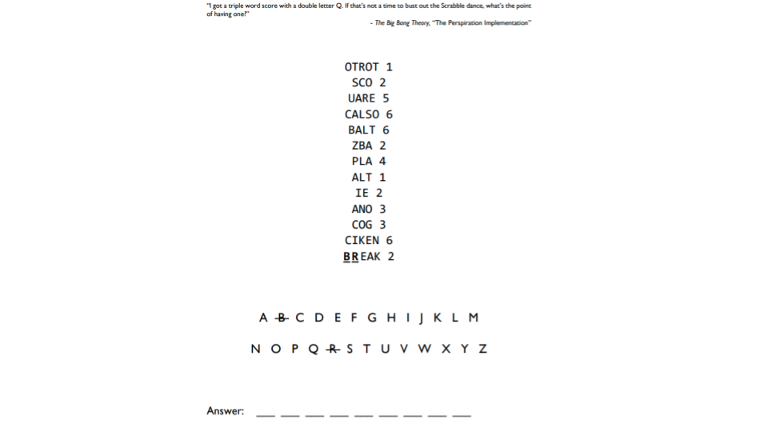

<h1><strong>STUDENT VERSION (Week-26)</strong>

 
 
 
 
 
 

<h1><strong>Meeting Agenda</strong></h1>

▶ Icebreaking 

▶ Questions 

▶ Interview/Certification Questions

▶ Coding Challenge

▶ Video of the
week

▶ Retro
meeting

▶ Case study /
project

 
 
 

<h1><strong>Teamwork Schedule</strong></h1>

<table style= "width:100%;">
                <tr>
                <td style="color: #FA8072; text-align:left "><h3><strong>
Ice-breaking</td>
                <td style="color: #FA8072; text-align:right;"><h3><strong>
10m
<td>                </tr>
</table>

- Personal Questions (Stay at home & Corona, Study Environment, Kids etc.) 
- Any challenges (Classes, Coding, AWS, studying, etc.) 
- Ask how they’re studying, give personal advice. 
- Remind that practice makes perfect. 

<table style= "width:100%;">
                <tr>
                <td style="color: #FA8072; text-align:left "><h3><strong>
Team work</td>
                <td style="color: #FA8072; text-align:right;"><h3><strong>
10m
<td>                </tr>
</table>

- Ask what exactly each student does for the team, if they know each other, if they care for each other, if they follow and talk with each other etc. 

<table style= "width:100%;">
                <tr>
                <td style="color: #FA8072; text-align:left "><h3><strong>
Ask Questions</td>
                <td style="color: #FA8072; text-align:right;"><h3><strong>
20m
<td>                </tr>
</table>

**1. Which file is used to define dependency in Maven?**

<strong>A.</strong> build.xml   
<strong>B.</strong> pom.xml  
<strong>C.</strong> dependency.xml   
<strong>D.</strong> version.xml   

 

**2. What is the requirement for using Jenkins? (Choose 2 answers from the options given below)**

<strong>A.</strong> A source code repository which is accessible, for instance, a Git repository   
<strong>B.</strong> A working build script, e.g., a Maven script, checked into the repository    
<strong>C.</strong> Installed Docker   
<strong>D.</strong> None  

 

**3. Which of the following commands runs Jenkins from the command line?**

<strong>A.</strong> java -jar jenkins.war   
<strong>B.</strong> java -war jenkins.jar    
<strong>C.</strong> java -jar jenkins.jar   
<strong>D.</strong> java -war jenkins.war   

    

**4. How can we setup Jenkins jobs?**

<strong>A.</strong> Select new item from the menu   
<strong>B.</strong> After that enter a name for the job and select free-style job    
<strong>C.</strong> Then click OK to create new job in Jenkins   
<strong>D.</strong> The next page enables you to configure your job   
<strong>E.</strong> All of these  

 

**5. Containers include the application and all of its dependencies, but share the kernel with other containers. They run as an isolated process in userspace on the host operating system. They're also not tied to any specific infrastructure – Docker containers run on any computer, on any infrastructure, and in any cloud.**

<strong>A.</strong> True  
<strong>B.</strong> False  

 

<table style= "width:100%;">
                <tr>
                <td style="color: #FA8072; text-align:left "><h3><strong>
Interview/Certification Questions</td>
                <td style="color: #FA8072; text-align:right;"><h3><strong>
20m
<td>                </tr>
</table>

**1. What is the default Docker network driver, and how can you change it when running a Docker image?**

 

**2. How will you monitor Docker in production?**

 

**3. What is Docker Compose? What can it be used for?**

 

**4. What is Maven? What is the benefit of integrating Maven with Jenkins?**

 

**5.What are the advantages of Jenkins?**

 

<table style= "width:100%;">
                <tr>
                <td style="color: #FA8072; text-align:left "><h3><strong>
Video of the Week</td>
                <td style="color: #FA8072; text-align:right;"><h3><strong>
10m
<td>                </tr>
</table>

- [What is Continuous Integration?](https://www.youtube.com/watch?v=1er2cjUq1UI)

       

<table style= "width:97%;">
                <tr>
                <td style="color: #FA8072; text-align:left "><h3><strong>
Retro Meeting on a personal and team level</td>
                <td style="color: #FA8072; text-align:right;"><h3><strong>
10m
<td>                </tr>
</table>

Ask the questions below:

- What went well? 
- What could be improved? 
- What will we commit to do better in the next week? 

<table style= "width:100%;">
                <tr>
                <td style="color: #FA8072; text-align:left "><h3><strong>
Problem of the week</td>
                <td style="color: #FA8072; text-align:right;"><h3><strong>
5m
<td>                </tr>
</table>

- Students should work in small teams to complete the problem of the week.

 

**Answer:** *__________*

   

<table style= "width:96%;">
                <tr>
                <td style="color: #FA8072; text-align:left "><h3><strong>
Presentation of Coding  Challenge & POW</td>
                <td style="color: #FA8072; text-align:right;"><h3><strong>
20m
<td>                </tr>
</table>

We assume that each group has two sub teams. If this is possible one of the sub teams will present the coding challenge of last week. The other sub team will present the solution to the previous problem of the week. If there is only one sub team then, the sub team will present both of the solutions.

 

<table style= "width:100%;">
                <tr>
                <td style="color: #FA8072; text-align:left "><h3><strong>
Coding  Challenge</td>
                <td style="color: #FA8072; text-align:right;"><h3><strong>
5m
<td>                </tr>
</table>

- [Coding Challenge: Security Questions](https://github.com/clarusway/clarusway-aws-devops-1-20/tree/master/python/coding-challenges/cc-008-validate-customers-with-security-questions) 

 

<table style= "width:96%;">
                <tr>
                <td style="color: #FA8072; text-align:left "><h3><strong>
Presentation of Case Study of Previous Sprint</td>
                <td style="color: #FA8072; text-align:right;"><h3><strong>
20m
<td>                </tr>
</table>

We assume that each group has two sub teams. Each week, one of the sub-teams will present their solution.

<table style= "width:100%;">
                <tr>
                <td style="color: #FA8072; text-align:left "><h3><strong>
Case study/Project</td>
                <td style="color: #FA8072; text-align:right;"><h3><strong>
10m
<td>                </tr>
</table>

**Case study should be explained to the students during the weekly meeting and has to be completed in one week by the students. Students should work in small teams to complete the case study.**

- [Project-006 : Kittens Carousel Static Website deployed on AWS Cloudfront, S3 and Route 53 using Cloudformation](https://github.com/clarusway/clarusway-aws-devops-1-20/tree/master/aws/projects/006-kittens-carousel-static-web-s3-cf)
 

<table style= "width:105%;">
                <tr>
                <td style="color: #FA8072; text-align:left "><h3><strong>
Closing</td>
                <td style="color: #FA8072; text-align:right;"><h3><strong>
5m
<td>                   </tr>
</table>

-Next week’s plan

-QA Session 

